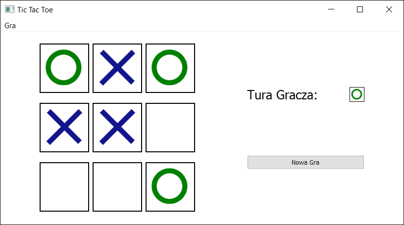

# Tic-Tac-Toe
This is a Simple application tic tac toe, wrote using Qt. If you want, you can play  this funny game ;)

## Table of content
* [General info](#general-info)
* [Screenshots](#screenshots)
* [Technologies](#technologies)
* [Status](#status)
* [Contact](#contact)

## General info
This aplication was written using Qt version 5.14.0. It is a simply aplication imitating Tic-tac-toe. In the future,  I will be added,
possiblity to play with computer. 

## Screenshots

## Technologies 

* Qt in version 5.14.0

## Status
Project is: _in progress 
In the feature will be added, possiblity to play with computer. 

## Contact
Created by [@Bartistero](https://github.com/Bartistero) - feel free to contact me!
